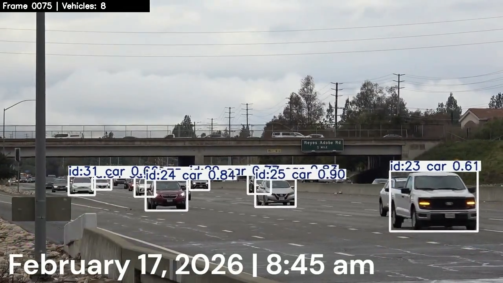
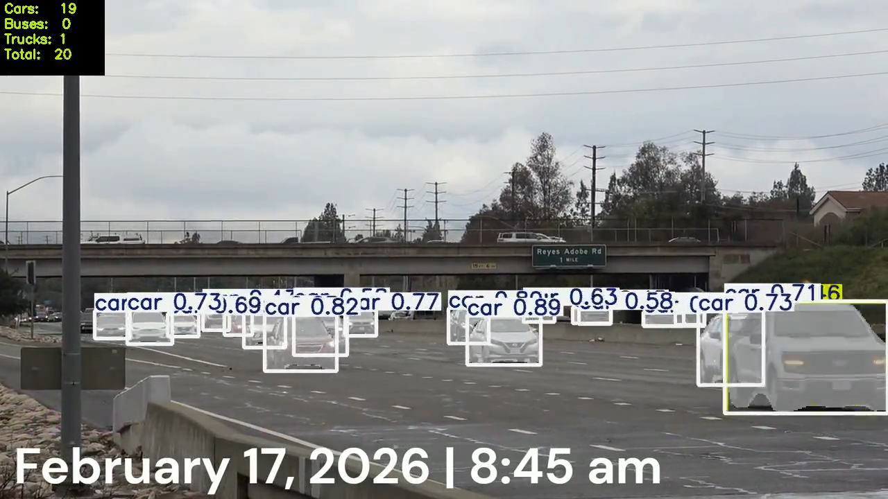
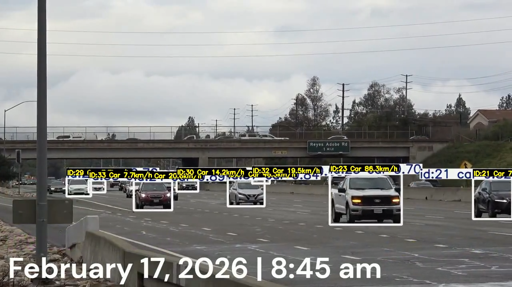
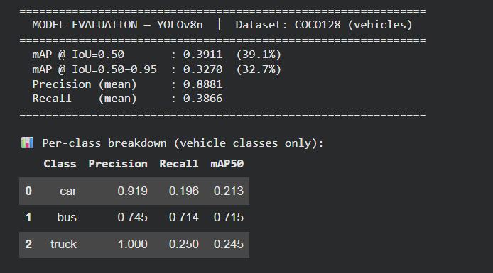
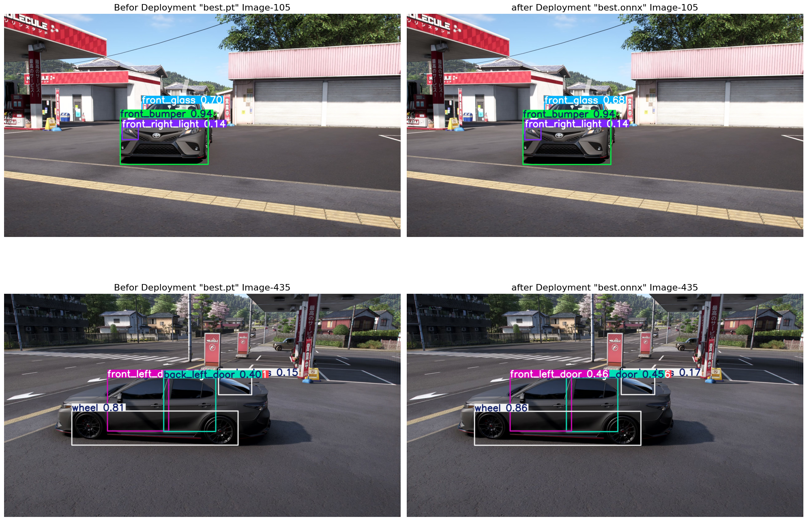

# Smart Traffic & Car Analytics System


## 🎓 SDAIA Academy Attribution
This project was developed as the final capstone project for the **Computer Vision for Developers with Ultralytics** training program (August 2026).  
Delivered by: [SDAIA Academy](https://github.com/SDAIAAcademy)

**Developer:** Mohammed Ahmed AlWanis (محمد أحمد الونيس)
Google Colab Link https://colab.research.google.com/drive/1a9vHwJTEW7MomIEudUVQWD5sBMjgv5mR?usp=sharing
---

## 📌 Project Overview
This computer vision project provides a real-world solution for highway traffic monitoring. It utilizes state-of-the-art YOLO models to detect, track, segment, count, and estimate the speed of vehicles (Cars, Buses, Trucks) on a highway video stream.

The project demonstrates a complete AI pipeline from custom dataset training and model evaluation to real-world video analytics and optimized deployment exporting.

---

## ✨ Key Features

1. **Core Vision Tasks (Instance Segmentation)**
   - Utilizes `yolov8n-seg.pt` to perform precise instance segmentation on vehicles, capturing exact vehicle masks rather than standard bounding boxes.
2. **Real-World Video Analytics**
   - Implements a robust OpenCV pipeline processing a real highway video (`Cars.mp4`).
   - Uses `model.track()` for consistent vehicle tracking.
   - Integrates Ultralytics solutions (`ObjectCounter` & `SpeedEstimator`) to count vehicles passing through a defined polygon region and calculate their speed in Km/h.
3. **Model Evaluation & Metrics**
   - Performs a validation run (`model.val()`) on a real vehicle dataset.
   - Extracts and interprets key metrics (mAP50, mAP50-95, Precision, Recall) to understand model performance and thresholds.
4. **Custom Training (Fine-Tuning)**
   - Includes a custom training pipeline (`model.train()`) fine-tuning a YOLOv26 model on a real-world vehicle dataset sourced from Roboflow.
5. **Deployment & Export**
   - Exports the trained model to the highly optimized **ONNX** format (`model.export(format='onnx')`) for fast, cross-platform inference.

---

## 🛠️ Prerequisites & Setup

To run this project, you need a Python environment (Google Colab is highly recommended for GPU acceleration).

**Required Libraries:**
```bash
pip install ultralytics opencv-python-headless pillow pandas
apt-get install ffmpeg
```
## Part 1: Core Vision Task & inference
### -Cars Tracking And Segmention
### -Car Tracking:



-CarSegmention:



## Part 2: Real World Solution and Video Analysis 
### -Speed Est:



## Part 3: Model Evalution 
### - Model Evalution:



## Part 4-5: Custom Data & Training and Deployment and Export  
### -Test The model Before Deployment and After:


